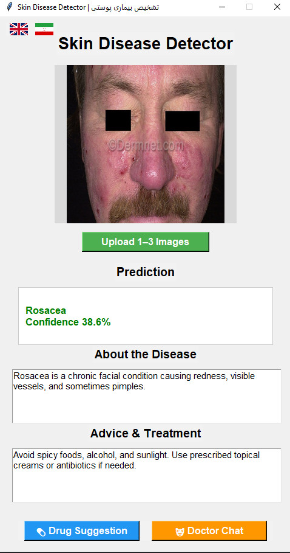

# 🩺 Skin Disease Classifier

A bilingual deep learning-based desktop application for **automatic skin disease classification**, built using **TensorFlow**, **Keras**, and **Tkinter GUI**.

This software identifies skin diseases from user-submitted images.  
Users can upload 1–3 skin images, and the model will predict the disease type, provide a brief description, and suggest possible treatments.

---

## 🌍 Languages
- English 🇬🇧  
- Persian 🇮🇷  

The application supports a bilingual interface, allowing users to switch between **English** and **Persian** via language buttons on the top bar.

---

## 🚀 Features
- Upload and classify **1–3 skin images** instantly  
- Fine-tuned **MobileNetV2** model using TensorFlow and Keras  
- **Bilingual GUI** (English + Persian)  
- Integrated buttons for:
  - 🧠 **ChatGPT API connection** *(requires your own API key implementation)*  
  - 🛒 **Drug Store API connection** *(for medical product suggestions)*  
- Displays:
  - Disease name  
  - Description  
  - Treatment advice  

---

## 🧠 Model Overview
The classifier uses a **fine-tuned MobileNetV2** trained on **56,000 images** across **30 skin disease classes**.  
It provides high accuracy and runs efficiently on both CPU and GPU.

> ⚠️ **Note:**  
> The public version does **not include** the trained model (`skin_model_final_v3.h5`) or dataset due to size and license restrictions.  
> You can train your own model using:
> ```bash
> python train_model_finetune.py
> ```

---

## 🧩 Key Libraries and Frameworks

The project integrates several major Python libraries, each contributing to a specific stage of the system:

### 🔹 TensorFlow / Keras
Used for **model design, training, and fine-tuning**.  
A pre-trained **MobileNetV2** architecture was imported and retrained on 56,000 labeled images across 30 skin diseases.  
TensorFlow handled GPU acceleration and model serialization (`.h5` format).

### 🔹 OpenCV
Responsible for **image preprocessing** — including resizing, normalization, and enhancement before feeding the data into the neural network.  
It also helps with real-time visualization and testing during model validation.

### 🔹 NumPy & Pandas
Used for **data manipulation and statistical analysis** of the dataset before model training.  
These libraries ensure efficient handling of large image metadata and CSV-based class mappings.

### 🔹 Tkinter
Provides the **Graphical User Interface (GUI)**.  
Users can upload up to three images, view predictions, and read disease information or treatment advice in either English or Persian.  
This bilingual GUI was designed to be lightweight and intuitive.

### 🔹 Matplotlib
Used mainly for **visualizing training metrics** (accuracy/loss graphs) and dataset distributions.

---

> These libraries together enable the app to combine machine learning, data processing, and user interactivity into a unified desktop-based skin disease detection tool.

---

## 🧪 Datasets Used
Training data was collected from publicly available Kaggle datasets:

1. [20 Skin Diseases Dataset – Haroon Alam](https://www.kaggle.com/datasets/haroonalam16/20-skin-diseases-dataset?resource=download)  
2. [Skin Diseases Image Dataset – Ismail Promus](https://www.kaggle.com/datasets/ismailpromus/skin-diseases-image-datase)  
3. [Skin Disease Dataset – Fares Abbas](https://www.kaggle.com/datasets/faresabbasai2022/skin-disease?utm_source=chatgpt.com)  
4. [20 Skin Diseases Dataset – Haroon Alam (Alternate Link)](https://www.kaggle.com/datasets/haroonalam16/20-skin-diseases-dataset?utm_source=chatgpt.com)  
5. [Skin Cancer MNIST: HAM10000 – K. Mader](https://www.kaggle.com/datasets/kmader/skin-cancer-mnist-ham10000?utm_source=chatgpt.com)

After preprocessing and augmentation, the final merged dataset contained approximately **56,000 images** across **30 unique classes**.

---

## 🧩 Dataset Preparation and Merging

After downloading the datasets from Kaggle, you must merge them into a single dataset before training.  
Use the provided Python script:

```bash
python merge_skin_datasets.py
```

This script automatically combines all datasets into one unified folder structure suitable for training.  
However, you must **manually update the file and folder paths** inside the script to match your own system directories —  
for example:

```python
# Example inside merge_skin_datasets.py
source_paths = [
    "D:/Datasets/SkinData1/",
    "D:/Datasets/SkinData2/",
    "D:/Datasets/SkinData3/"
]

destination_path = "D:/SkinDiseaseClassifier/data/merged_dataset/"
```

Once merging is complete, proceed to fine-tune the model by running:

```bash
python train_model_finetune.py
```

---

## 🧬 Diseases Covered
This model recognizes a wide range of dermatological conditions, including:
- Acne  
- Eczema  
- Psoriasis  
- Melanoma  
- Basal Cell Carcinoma (BCC)  
- Seborrheic Keratosis  
- Actinic Keratosis  
- Tinea (Ringworm)  
- Rosacea  
- Vitiligo  
...and more (over **30 classes** total).


---

## 🎥 Demo

Below is the demonstration of the **Skin Disease Classifier** application.

### 🖼 App Screenshot


### ▶️ Watch Demo Video
<a href="https://github.com/alisattarzadeh46/Skin-Disease-Classifier/raw/main/demo/demo.mp4">
  
</a>

> The demo shows how the user uploads skin images, receives disease predictions, and views bilingual treatment advice.

---

## 🏗️ Project Architecture

The **Skin Disease Classifier** project follows a **Modular MVC (Model–View–Controller)** architecture combined with a **component-based structure** for clarity, scalability, and maintainability.

### 🔹 Overview

- **Model (M):**  
  Handles machine learning logic — training, fine-tuning, and prediction using TensorFlow/Keras.  
  **Key scripts:**  
  - `train_model_finetune.py` → fine-tunes the MobileNetV2 model on the merged dataset.  
  - `predict.py` → loads the trained model and performs inference on user images.  
  - `merge_skin_datasets.py` → merges multiple Kaggle datasets into a unified structure.

- **View (V):**  
  Provides the bilingual graphical user interface (English and Persian) for user interaction.  
  - Located in the `ui/` folder.  
  - Built with **Tkinter**, displaying uploaded images, predictions, disease descriptions, and treatment advice.  
  - Supports visual results and multilingual text rendering.

- **Controller (C):**  
  Bridges the model and the user interface.  
  - Implemented mainly in `run_app.py`.  
  - Manages workflow events — image upload, model prediction, and dynamic UI updates.

---

## 🧾 License
Released under the **MIT License** — free for educational, academic, and research use.

---

## 👨‍💻 Author
Developed by **Ali Sattarzadeh**  
For academic and research purposes in **Machine Learning** and **Computer Vision**.

> ⭐ If you like this project, please star the repository on GitHub!
